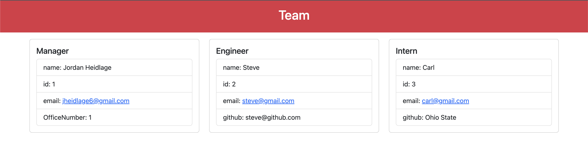

# Jordan Heidlage Team Profile Generator

## Description

This application utilizes node.js command-line applications to take in information about employees on an Engineering team, and generate an HTML webpage to display summaries for each of these people.

## Table of Contents

- [Installation](#installation)
- [Usage](#usage)
- [Credits](#credits)
- [License](#license)

## Installation

Upon downloading this program, use the "npm i" command in your terminal to install the npm libraries.

## Usage
Video Walkthrough: 

https://drive.google.com/file/d/1PM25f7arPMmFbAC2dWtiPoQN4OEoV4hO/view

Use the "node index" command in your terminal, you'll be prompted with a series of questions related to the employee structure. Upon completion of the questions, an HTML file will be generated in your "dist" folder of the team structure.

## Credits

- Jordan Heidlage (jheidlage6@gmail.com)
- Instructional staff of The Ohio State University

## License

